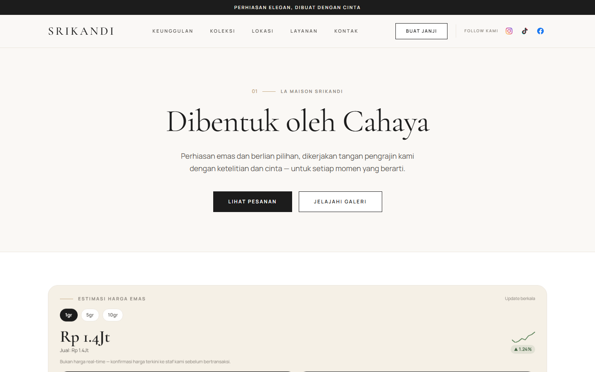
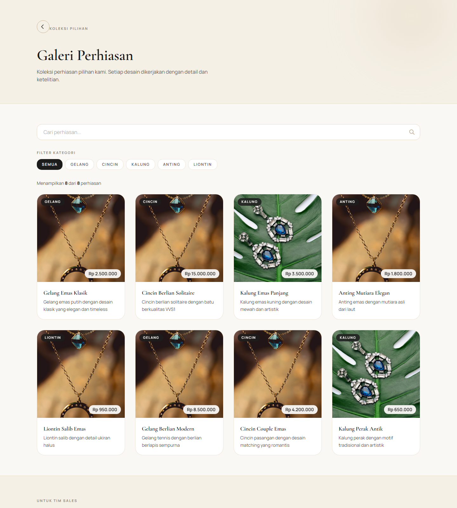
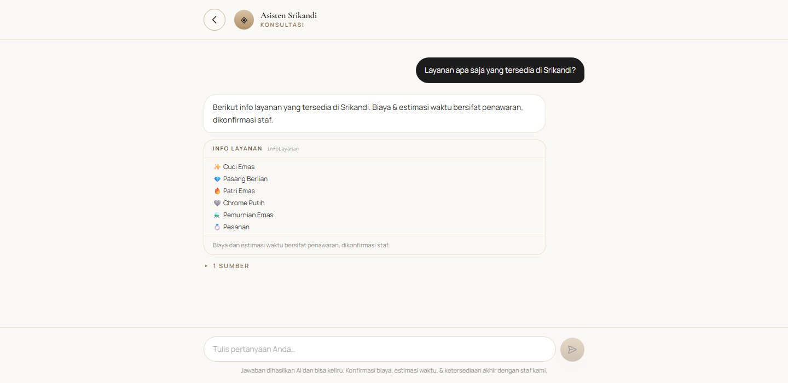
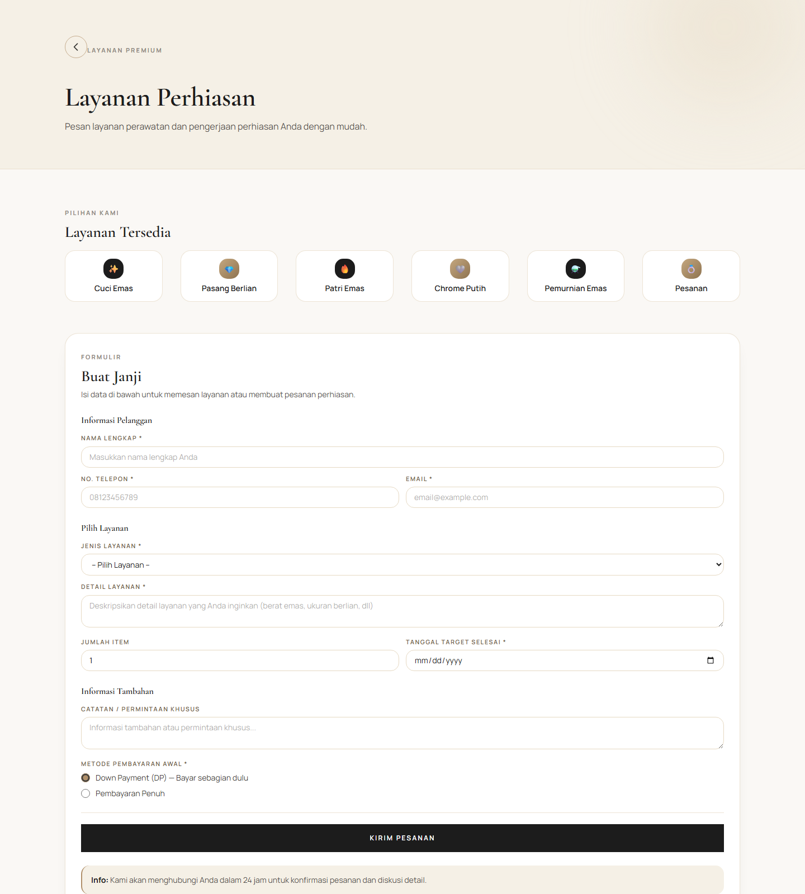

# 🪙 Srikandi — Jewelry Storefront with an AI Consultation Assistant

**🌐 Live site:** <https://bajoel32.github.io/bajoel32/>

A storefront for a gold & jewellery shop (Toko Emas Srikandi, Palangka Raya) with an
**AI consultation assistant** built on **Anthropic Claude** — retrieval-augmented answers
over a curated knowledge base, **function/tool calling** into store data, a **4-layer
guard rail**, and hard **cost controls**.

> **Scope of this repo:** the **storefront frontend** (`src/`, React + Vite, deployed to
> GitHub Pages). The Express **API / AI backend** (`server/`) is developed in a separate
> repo — code references to `server/…` in the docs point there. See
> [DEVELOPMENT.md](DEVELOPMENT.md) for the frontend guide and
> [docs/konsultasi-ai/](docs/konsultasi-ai/) for the full backend contract.

---

## 📸 Screenshots

| Home | Catalogue |
|---|---|
|  |  |

| **AI Consultation** — RAG answer + a `infoLayanan` tool-result card + retrieved source | Booking / service request |
|---|---|
|  |  |

*(The standalone Admin Hub is a separate app and is not yet built/deployed — no screenshot.)*

---

## 🌟 What it does

### Customer-facing (this repo)
* **Catalogue** — collections, category filter + search, gold-purity / weight, a
  **manually-maintained gold-price estimate** card (clearly labelled *not* a live feed).
* **Order portal** — phone + password (bcrypt) login, per-customer order tracking.
* **Service booking** — validated form with an anti-bot honeypot.
* **AI Consultation assistant** — chat UI backed by `POST /api/consult`
  (RAG + Claude tool-calling, with a zero-cost keyword fallback).

### Backend (separate repo — `server/`)
* Express API: bookings, auth/sessions, orders, gallery, `/api/consult`, `/api/admin/*`.
* AES-256-GCM **encryption at rest** for customer collections; PII retention sweeper.
* **Admin Hub API** (`/api/admin/*`, bcrypt-session) — CRUD for the knowledge base,
  services and gallery; RAG parameter tuning; a stats endpoint. A dedicated admin
  **frontend** app is planned, not built.

---

## 🧠 AI / LLM Tech Stack

| Concern | What is actually used | Notes |
|---|---|---|
| **LLM provider** | **Anthropic Claude** via **`@anthropic-ai/sdk` `^0.32`** | server-side only; the key never reaches the browser |
| **API surface** | **Messages API** — `client.messages.create({ system, tools, messages })`, non-streaming, `max_tokens: 1024` | streaming (SSE) is on the roadmap |
| **Model** | `ANTHROPIC_MODEL` env — default **`claude-opus-5`**; `claude-sonnet-5` / `claude-haiku-4-5` for lower cost | swappable without code changes |
| **Orchestration framework** | **None** — a hand-rolled tool-use loop (max **4 hops**) in `server/src/lib/claude.js` | deliberate: no LangChain / LlamaIndex; the whole backend has 9 runtime deps |
| **Retriever** | **Keyword / bag-of-words** scorer over the `kb` collection (`server/src/lib/rag.js`) | **no embeddings, no vector DB** — see [RAG Pipeline](#-rag-pipeline) and [Roadmap](#-observability--evaluation) |
| **Embedding model** | *none yet* | roadmap item |
| **Vector store** | *none yet* — knowledge base is JSON (dev) or a Postgres `jsonb` blob | roadmap: pgvector / Qdrant |
| **Fallback path** | `fallbackConsult()` — regex/keyword matching, **0 API cost** | serves anonymous users, missing-key, and over-budget requests |
| **Guard rails** | 4 layers (client input, server prompt-injection screen, prompt hardening, output redaction) | [details below](#-llm-safety--cost-controls) |
| **Cost controls** | soft-gate (LLM only for logged-in members) · persisted daily call budget · layered rate limits | [details below](#-llm-safety--cost-controls) |

Frontend: **React 19 + Vite 8 + Tailwind CSS v4**. Backend: **Node + Express 4**, `zod`,
`helmet`, `express-rate-limit`, `bcryptjs`, `pg`.

---

## 🔍 RAG Pipeline

**Knowledge base.** A curated JSON array — `server/data/kb.json` — seeded with ~12 entries,
each of shape:

```json
{ "id": 7, "title": "Kebijakan pembatalan", "text": "Pembatalan dapat dilakukan dalam 24 jam …", "url": null }
```

**Chunking / indexing.** There is no automated splitter: **each KB entry *is* one chunk**
(1–3 sentences, authored by hand or via the Admin Hub). Kept deliberately short so a
keyword match maps cleanly to a self-contained answer. No embeddings are computed;
"indexing" is just loading the array into memory on boot.

**Retrieval algorithm** (`retrieve(query)` in `server/src/lib/rag.js`):

1. **Tokenise** the query — lowercase → strip non-alphanumerics → split on whitespace →
   drop tokens ≤ 2 chars and ~22 Indonesian/English stop-words (`yang`, `dan`, `apa`, `the`, …).
2. **Score every KB entry** — build a token set for `title + text` and a set for `title` only:
   `+1.0` per query token found in the body set, `+1.5` if it is also in the title set.
3. **Filter** `score ≥ minScore` (default **0.5**), sort descending, take the top **`topK`**
   (default **4**). `topK` and `minScore` are runtime-tunable from the Admin Hub
   (`settings` collection, key `rag`).
4. Return each hit as `{ title, snippet: text.slice(0, 240), url }` — surfaced to the user
   under an **"N Sources"** disclosure in the chat UI.

**Prompt assembly.** The retrieved snippets are injected as a `KONTEKS` block in a leading
user turn; the system prompt instructs the model to answer **only** from that context or
the tool results, and to escalate otherwise.

---

## 🛠️ Function Calling

Four tools are registered (`TOOLS` array in `server/src/lib/claude.js`); Claude decides when
to call them, the backend runs a **pure local function** (`RUNNERS` map) against the DB,
returns the result as a `tool_result` block, and loops until `end_turn` (≤ 4 hops).

| Tool | Purpose | Guard |
|---|---|---|
| `infoLayanan` | list service types (no prices) | — |
| `cekStatusPesanan` | one order's status & progress | **ownership check** — order no. + orderer name + registered phone must all match |
| `rekomendasiGaleri` | gallery items by category / max budget | — |
| `eskalasiKeAdmin` | hand off to a human | result is mapped to an `escalate` field → WhatsApp deep link |

Example — the `input_schema` for `cekStatusPesanan` (JSON Schema, verbatim from the code):

```jsonc
{
  "name": "cekStatusPesanan",
  "description": "Status & progres satu pesanan. WAJIB verifikasi kepemilikan: butuh nomorPesanan (SR-NNN-YYYY) + nama pemesan + hp terdaftar. Tanpa nama & hp yang cocok, tool balas needVerification/mismatch tanpa detail — jangan sebut apa pun soal pesanan itu.",
  "input_schema": {
    "type": "object",
    "additionalProperties": false,
    "properties": {
      "nomorPesanan": { "type": "string", "pattern": "^SR-\\d{3}-\\d{4}$" },
      "nama": { "type": "string", "description": "Nama pemesan sesuai data pesanan." },
      "hp":   { "type": "string", "description": "Nomor HP yang terdaftar pada pesanan." }
    },
    "required": ["nomorPesanan"]
  }
}
```

Return shapes: `{ orderNumber, customerName, status, progress, goldPurity }` on a full
match, otherwise `{ notFound }` / `{ needVerification }` / `{ mismatch }` — the model is
instructed to reveal **nothing** about an order until verification passes. The same rule is
enforced in the keyword fallback path. Full contract:
[docs/konsultasi-ai/CHATBOT.md](docs/konsultasi-ai/CHATBOT.md).

---

## 🛡️ LLM Safety & Cost Controls

**4-layer guard rail** (details in [docs/konsultasi-ai/SECURITY.md](docs/konsultasi-ai/SECURITY.md) §3):

| Layer | Where | Does |
|---|---|---|
| Input — client | `src/config/guardrails.js` | reject gibberish / >50 % symbols / a char repeated ≥ 10× · block PII (16-digit ID no., 13–19-digit card, email, ID phone) · anti-flood (identical to one of the last 3 turns) · strip control + zero-width chars |
| Input — server | `server/src/lib/guardrails.js` → `screenInbound()` | 13 prompt-injection / jailbreak patterns (ID + EN) on the last user turn → canned reply, **never forwarded to the model**, `mode: "blocked"`, `guardBlocks` counter |
| Prompt hardening | `SYSTEM` prompt in `claude.js` | message content is treated as **data, not instructions**; never disclose the system prompt / tool names; topic-locked to Srikandi |
| Output | `server/src/lib/guardrails.js` → `sanitizeOutbound()` | truncate a reply > 2000 chars · redact `sk-ant-…` / `sk-…` / 64-hex / `ANTHROPIC_API_KEY` → `[disamarkan]` · replace the whole reply if it echoes a system-prompt telltale |

**Cost controls:**

* **Soft-gate** — Claude is only called for a **logged-in customer session**
  (`optionalAuth` + `isMember`). Anonymous visitors still get the assistant, served by the
  **zero-cost keyword fallback**. Every response carries `mode: "live" | "fallback" | "blocked"`.
* **Daily LLM budget** — `CONSULT_DAILY_LLM_BUDGET` (default **300** real calls/day),
  counted in the DB (`counters` collection) so it **survives a process restart**. Over
  budget → everyone drops to the fallback until the date rolls over.
* **Layered rate limits** — `8 / min / IP` **and** `40 / day / sender` (keyed by session
  token when logged in, else IP).
* **Logs are PII-redacted** — `consult_logs` keeps the last 200 turns with `redactPii()`
  applied to `question` and `replyPreview` (phones, emails, ≥ 12-digit runs → placeholders).

---

## 📊 Observability & Evaluation

**Instrumented today** (`server/src/lib/metrics.js`, in-memory, reset on restart), exposed
at `GET /api/admin/stats`:

* `consultCalls`, `consultToday`, `escalations`
* `ragQueries`, `avgRagSources` (mean retrieved snippets per answer)
* `guardBlocks` (prompt-injection screen hits), `rateLimited`, `errors5xx`
* `llmCallsToday` vs `llmDailyBudget`
* Plus **`consult_logs`** — the last 200 redacted transcripts (`question`, `replyPreview`,
  `mode`, `member`, `escalated`, `sources`, `turns`, `at`) for **manual** quality review in
  the Admin Hub.

**Not yet measured — honest gap:** there is **no automated evaluation** and **no latency
instrumentation**. Answer quality is currently judged by eyeballing `consult_logs`.

### 🧭 Roadmap

| Area | Plan |
|---|---|
| **Retrieval** | replace the keyword scorer with **embeddings + a vector store** (pgvector or Qdrant), an explicit chunker for longer docs, and hybrid (dense + BM25) ranking |
| **Evaluation** | a golden Q&A set; **groundedness / faithfulness** scoring of each answer against its retrieved `sources`; a hallucination-rate metric; an **LLM-as-judge** rubric; a regression gate in CI |
| **Latency & cost** | per-turn wall-time **p50 / p95**, tokens in/out, and **$ per conversation** — surfaced in `/api/admin/stats` and alertable |
| **UX** | **streaming** responses (SSE) instead of one blocking JSON |
| **Admin Hub** | build the dedicated `srikandi-admin` frontend on top of the existing `/api/admin/*` routes |

---

## 🏗️ System Architecture

```text
                 ┌─────────────────────────── this repo ───────────────────────────┐
  Customer ────► │  React + Vite storefront  (GitHub Pages)                         │
                 │      │  fetch  POST /api/consult { messages[] }                   │
                 └──────┼────────────────────────────────────────────────────────────┘
                        ▼
        ┌───────────────────────────── server/ (separate repo) ─────────────────────────┐
        │  Express API                                                                  │
        │   1. guard rail: screenInbound()      → blocked? canned reply                 │
        │   2. RAG: retrieve()  ── keyword scorer over kb.json  → sources[]             │
        │   3. gate: isMember && key && dailyBudget.tryConsume() ?                       │
        │        ├─ yes → Claude Messages API + TOOLS  ⇄  tool loop (≤4 hops)           │
        │        │            RUNNERS[name](input) → DB (json file | Postgres jsonb)    │
        │        └─ no  → fallbackConsult()  (keyword, 0 cost)                          │
        │   4. guard rail: sanitizeOutbound()   → redact / truncate                     │
        │   5. log (PII-redacted)  ·  metrics++                                         │
        │  { reply, sources?, functions?, escalate?, mode }                             │
        └──────────────────────────────────────────────────────────────────────────────┘
                        ▲
   Admin/Manager ───────┘   /api/admin/*  (bcrypt session) — KB & content CRUD, RAG params, stats
                             dedicated Admin Hub UI → planned
```

---

## 📚 Docs

| Doc | Contents |
|---|---|
| [DEVELOPMENT.md](DEVELOPMENT.md) | frontend: where to change what, styling, deploy |
| [docs/konsultasi-ai/CHATBOT.md](docs/konsultasi-ai/CHATBOT.md) | `/api/consult` contract, tool schemas, escalation, RAG notes |
| [docs/konsultasi-ai/API-SCHEMA.md](docs/konsultasi-ai/API-SCHEMA.md) | every endpoint, sequence diagrams, data model |
| [docs/konsultasi-ai/SECURITY.md](docs/konsultasi-ai/SECURITY.md) | frontend + backend security posture, guard rails, open gaps |
| [docs/konsultasi-ai/BACKEND.md](docs/konsultasi-ai/BACKEND.md) · [ORDERS-AUTH.md](docs/konsultasi-ai/ORDERS-AUTH.md) · [LANGKAH-PROSES.md](docs/konsultasi-ai/LANGKAH-PROSES.md) | backend checklist · order-portal auth · step-by-step setup |
