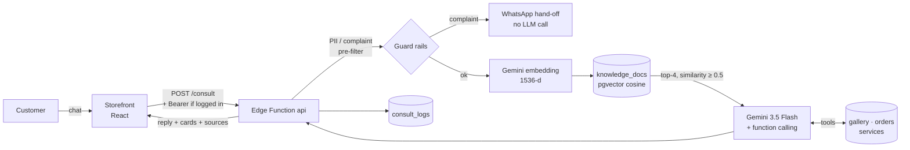

<div align="center">

# Srikandi: Jewellery Storefront with a RAG Consultation Assistant

**A real storefront for Toko Emas Srikandi, a gold and jewellery shop in Palangka Raya. It covers the catalogue, service bookings, a private order portal and an AI assistant grounded in the shop's own knowledge base, with an eval harness to back it up.**

[](https://bajoel32.github.io/bajoel32/)
[](https://srikandi-admin.vercel.app/)


[Backend repo](https://github.com/Bajoel32/srikandi-backend) · [Eval harness](https://github.com/Bajoel32/srikandi-backend/tree/main/eval) · [Incident write-up](https://github.com/Bajoel32/srikandi-backend/blob/main/docs/incidents/2026-09-16-gemini-503.md) · [Frontend guide](DEVELOPMENT.md)


</div>

## Overview

Srikandi is a working website for a physical gold and jewellery shop. I own the
shop and built the site myself. It is split across three deployables:

| Part | What it is | Where |
| --- | --- | --- |
| **Storefront** (this repo) | React + Vite single-page app for customers | [GitHub Pages](https://bajoel32.github.io/bajoel32/) |
| **Backend** | PostgreSQL with RLS, plus one Supabase Edge Function `api` (Deno/TypeScript) | [`Bajoel32/srikandi-backend`](https://github.com/Bajoel32/srikandi-backend) |
| **Admin panel** | Booking inbox for shop staff, using Supabase Auth (magic link) and an `admin_users` allow-list | [srikandi-admin.vercel.app](https://srikandi-admin.vercel.app/) |

The browser never holds a secret. Every read and write goes through the Edge
Function, which holds the service-role key and the Gemini API key.

## Features

### For customers

- **Catalogue.** Collections with category filter, search and item details
  (price, tags, uploader). Items are served from the `gallery` table. The gold-price card is a
  manually maintained estimate and is clearly labelled as not live.
- **Service booking ("Buat Janji").** Customers pick a service (Cuci Emas,
  Pasang Berlian, Patri Emas, Chrome Putih, Pemurnian Emas, custom orders),
  quantity, target date and payment preference (DP / Lunas / Cicilan). The form
  is validated on both client and server, has a honeypot field, and is limited
  to 8 submissions per hour per IP.
- **Private order portal.** Customers log in with a phone number and access
  code (bcrypt-hashed) and see only their own orders and progress. Sessions last
  12 hours, and the database stores only the SHA-256 of each token.
- **AI consultation assistant.** A chat that answers from the shop's knowledge
  base and live database. It can show service and gallery cards, check the
  status of a logged-in customer's order, and hand off to the shop's WhatsApp
  when a human is needed.

### For staff

- **Booking admin panel.** New bookings land in an inbox with the statuses
  *Baru → Diproses → Selesai / Dibatalkan*. Staff can search by name or phone,
  view details, contact the customer on WhatsApp, and reopen a booking. Access is
  restricted by row-level security to emails listed in `admin_users`. The panel
  was designed for shop staff who are not technical.
- **Sales upload gate.** Staff with the shared sales key can add catalogue
  items straight from the gallery page. The key is sent as SHA-256 and stored
  server-side as a hash of that hash.
- **Customer-knowledge loop.** Recurring customer questions (DP rules, bank
  transfers, name pendants, ring sizing, shipping) are written up as
  `knowledge_docs` and embedded for retrieval. Every chat turn is stored in
  `consult_logs` (question, answer, whether it escalated), so gaps in the
  knowledge base show up from real traffic.

## How the assistant works



1. **Guard rails run before the model.** The browser rejects gibberish,
   floods and personal data such as ID numbers, cards, emails and phone numbers.
   The server checks again. Complaint and refund keywords are escalated to
   WhatsApp without calling the LLM, so they cost no tokens.
2. **Retrieval.** The question is embedded with `gemini-embedding-001` at 1536
   dimensions and matched against `knowledge_docs` with the
   `match_knowledge_docs` RPC (pgvector, cosine). If embedding fails, the
   assistant still answers, only without document context.
3. **Tool calling.** Gemini chooses from four tools that read the database:

   | Tool | Purpose | Guard |
   | --- | --- | --- |
   | `infoLayanan` | List the shop's services | — |
   | `rekomendasiGaleri` | Search the catalogue by keyword, category or max price | Published items only |
   | `cekStatusPesanan` | Progress of an order | **Logged-in session only**; never reveals whether an order number exists |
   | `hubungiAdmin` | Hand off to a human | Returns a WhatsApp deep link |

4. **Grounding rules.** The system prompt forbids inventing prices, lead
   times, gold purity or stock. It never shares bank account numbers and never
   asks for access codes in chat. Replies are limited to four sentences in
   Indonesian.
5. **Resilience.** Gemini 429 and 5xx errors and network failures are retried
   with backoff within a 30-second budget, with an optional fallback model. If
   all of that fails, the customer gets an "assistant is busy" reply with a
   WhatsApp button instead of an HTTP 500.

## Evaluation harness

Changing a prompt or model can break behaviour without breaking any unit
test, so the backend ships a zero-dependency eval harness
([`eval/`](https://github.com/Bajoel32/srikandi-backend/tree/main/eval)) that
runs as a CI-style regression gate. It exits with code 1 on any failure.

| | `run.mjs` (live) | `offline.mjs` |
| --- | --- | --- |
| Tests | How the **model** behaves in production | How the **code** around the model behaves |
| Gemini and Supabase | Real | Deterministic fakes, with injectable 503, 429 and network errors |
| Cases | 20 golden cases + optional LLM-as-judge (`--judge`) for groundedness | 15 cases |
| Cost | 1 Gemini call per case | Free, about 10 s |

**What it measures:** `grounding` (no invented prices or stock), `tool-use`,
`auth` (no order-status leaks, no order-number enumeration), `guardrail`
(escalation, PII blocking, prompt injection), `format`, `rag` (facts from
`knowledge_docs` reach the answer), `resilience` and `tool-loop`.

**Latest results (16 Sep 2026)** — full write-up in
[`RESULTS.md`](https://github.com/Bajoel32/srikandi-backend/blob/main/eval/RESULTS.md):

| Harness | Target | Result |
| --- | --- | --- |
| `offline.mjs` | `consult.ts` **before** the resilience fix | 9 / 15 |
| `offline.mjs` | `consult.ts` **after** the fix (production) | **15 / 15** |
| `run.mjs` | Production, during a Gemini overload | 8 / 20 passed · 1 behavioural failure · 11 not measurable (Gemini busy or backend rate limit) |

Findings from these runs that fed back into the code:

- **Order-number enumeration.** For an existing order number and a missing one,
  the assistant used to give different replies (`notFound` vs
  `needVerification`). That difference was enough to probe `SR-001` through
  `SR-999`. It is fixed, and two eval cases now require the two replies to be
  indistinguishable.
- **Gemini 503 incident.** An overloaded model caused an HTTP 500, and the
  frontend fell back to a static answer that showed ring prices in response to
  "I don't know my ring size". This led to retry, fallback and busy-reply
  handling, plus resilience cases that fail against the old code.
  [Incident report →](https://github.com/Bajoel32/srikandi-backend/blob/main/docs/incidents/2026-09-16-gemini-503.md)
- **Similarity threshold is probably too loose.** An off-topic question still
  retrieved four documents at 0.53–0.56 similarity. The note in `RESULTS.md`
  proposes about 0.6, pending more samples.
- **Latency.** Answers that go through the model took 9.6–28.4 s (median about
  19 s). Guard-rail paths return in under 2 s.

## Tech stack

| Layer | Tools |
| --- | --- |
| Storefront | React 19, Vite 8, Tailwind CSS v4, oxlint |
| Backend | Supabase Postgres (RLS on every table), Edge Functions (Deno + TypeScript) |
| AI | Gemini `gemini-3.5-flash` (function calling), `gemini-embedding-001`, pgvector |
| Admin | React on Vercel, Supabase Auth magic link, `admin_users` RLS |
| CI/CD | GitHub Actions deploys the storefront to Pages and the Edge Function to Supabase; Vercel deploys the admin panel |

## Project structure (this repo)

```text
src/
├── App.jsx                     # Page routing and layout
├── components/
│   ├── BookingPage.jsx         # Booking page + FAQ
│   ├── BookingForm.jsx         # Validated booking form (honeypot, length caps)
│   ├── ConsultationPage.jsx    # AI chat UI: tool cards, sources, WhatsApp escalation
│   ├── OrdersPage.jsx          # Login + customer's own orders
│   ├── GalleryPage.jsx         # Catalogue, filters, detail view
│   ├── SalesPanel.jsx          # Staff upload gate
│   └── …                       # Hero, GoldPriceCard, PromoCarousel, BottomNav, …
└── config/
    ├── site.js                 # Brand copy, services, static fallback data
    ├── gallery.js · orders.js · consultation.js   # API clients (fall back to static data)
    └── guardrails.js           # Client-side input checks (PII, gibberish, flood)
docs/
├── screenshots/
└── konsultasi-ai/              # Design record of the earlier Express/Claude backend (legacy)
```

## Running locally

```bash
npm install
npm run dev          # http://localhost:5173/bajoel32/
```

With no environment variables, every feature falls back to static or dummy
data, so the UI works offline. To connect to the real backend, copy
`.env.example` to `.env.local`:

```bash
VITE_GALLERY_API=https://<project-ref>.supabase.co/functions/v1/api/gallery
VITE_BOOKINGS_API=https://<project-ref>.supabase.co/functions/v1/api/bookings
VITE_CONSULT_API=https://<project-ref>.supabase.co/functions/v1/api/consult
VITE_ORDERS_API=https://<project-ref>.supabase.co/functions/v1/api
```

Backend setup (migrations, secrets, deploy) is covered in the
[backend README](https://github.com/Bajoel32/srikandi-backend#readme).

### Deployment

- **GitHub Pages.** Pushing to `main` runs `.github/workflows/deploy.yml`. The
  repo variable `SUPABASE_FUNCTIONS_URL` supplies the four `VITE_*_API` values.
  If the variable is empty, the site still builds on static data.
- **Vercel.** `vercel.json` builds with `--base=/` and adds an SPA rewrite.

## Screenshots

| Catalogue | AI consultation | Booking |
| --- | --- | --- |
|  |  |  |

## Legacy design docs

[`docs/konsultasi-ai/`](docs/konsultasi-ai/) documents the first backend
design: Express, Anthropic Claude, a keyword retriever and a planned Admin Hub.
Production has since moved to Supabase + Gemini + pgvector, as described above.
Those documents are kept as a design record and are marked as legacy.

## Author and license

Built by **Muhammad Aswan** ([@Bajoel32](https://github.com/Bajoel32)), owner of Toko Emas Srikandi.
Released under the [MIT License](LICENSE).
