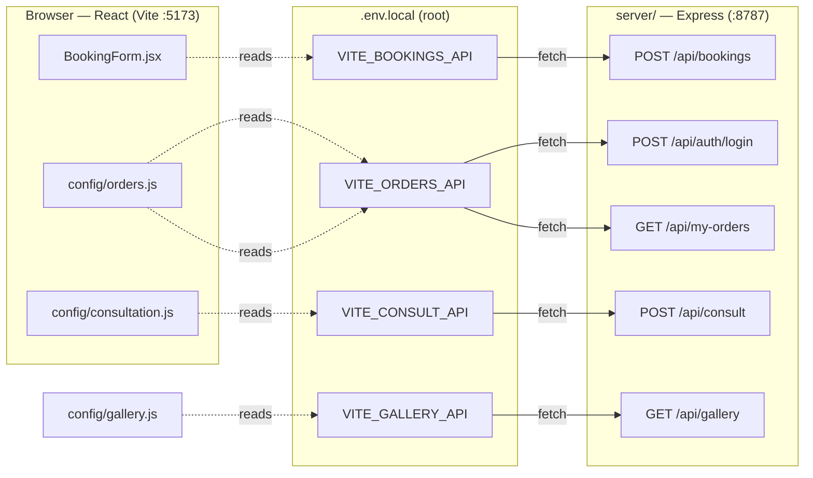
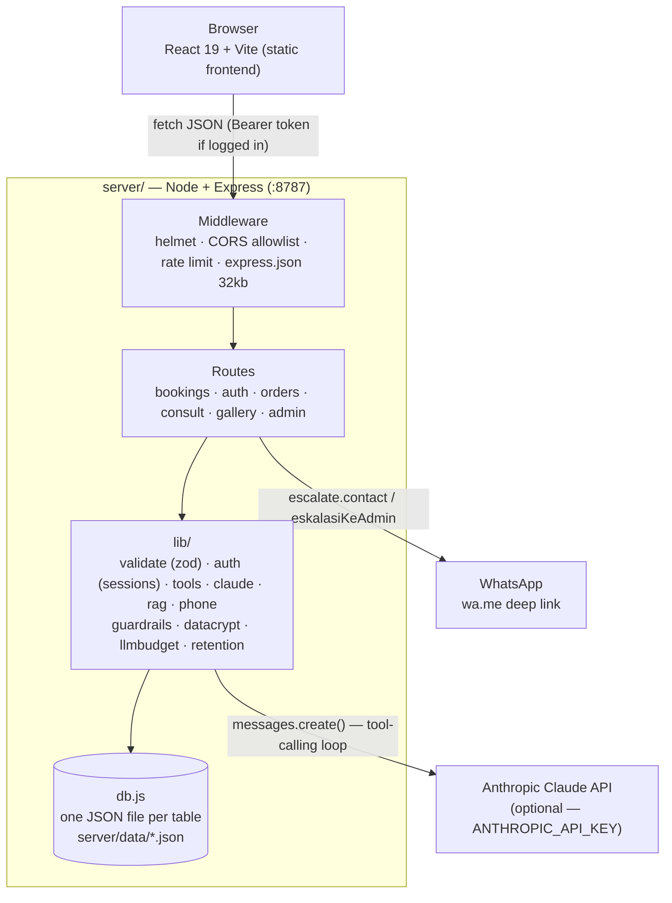
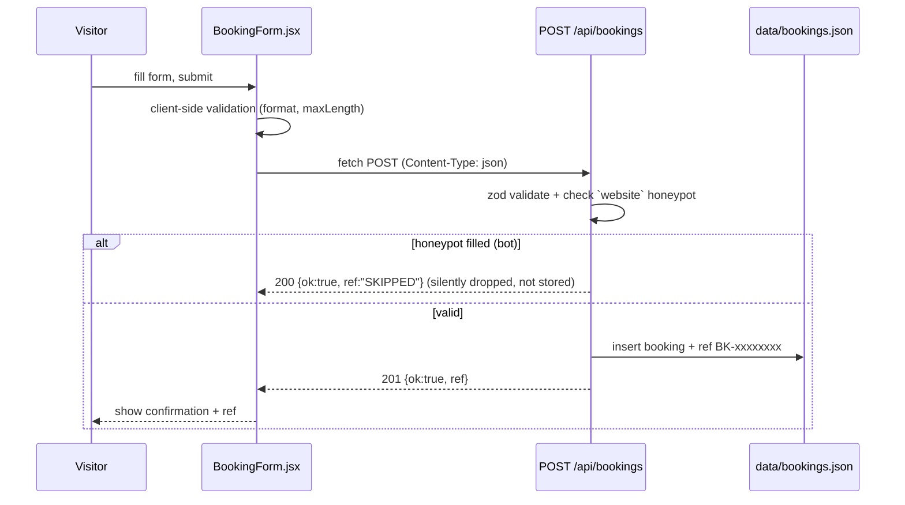
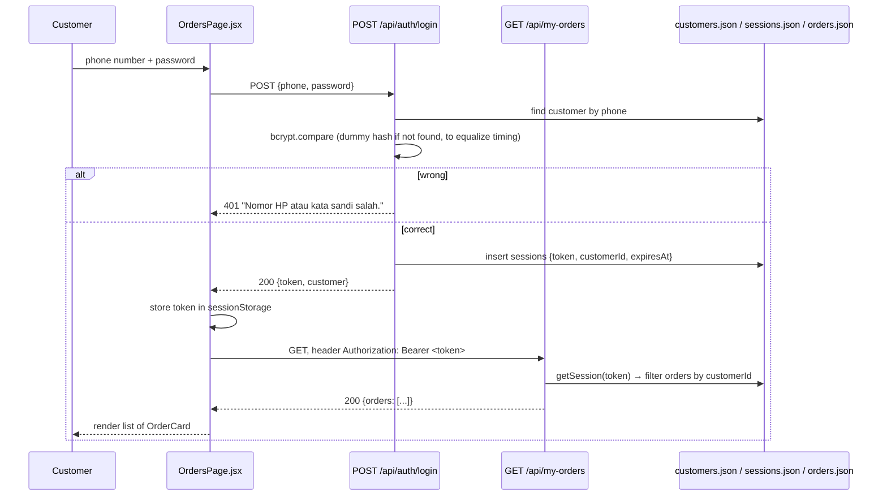
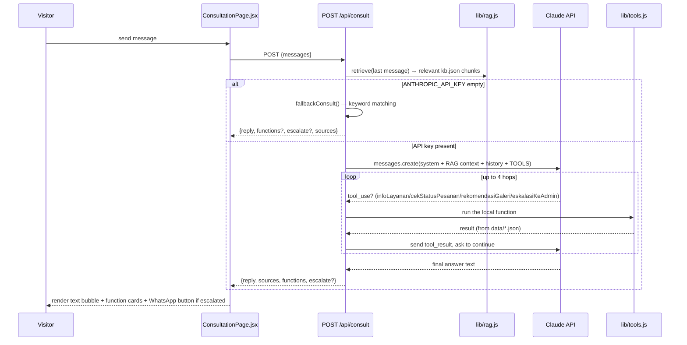
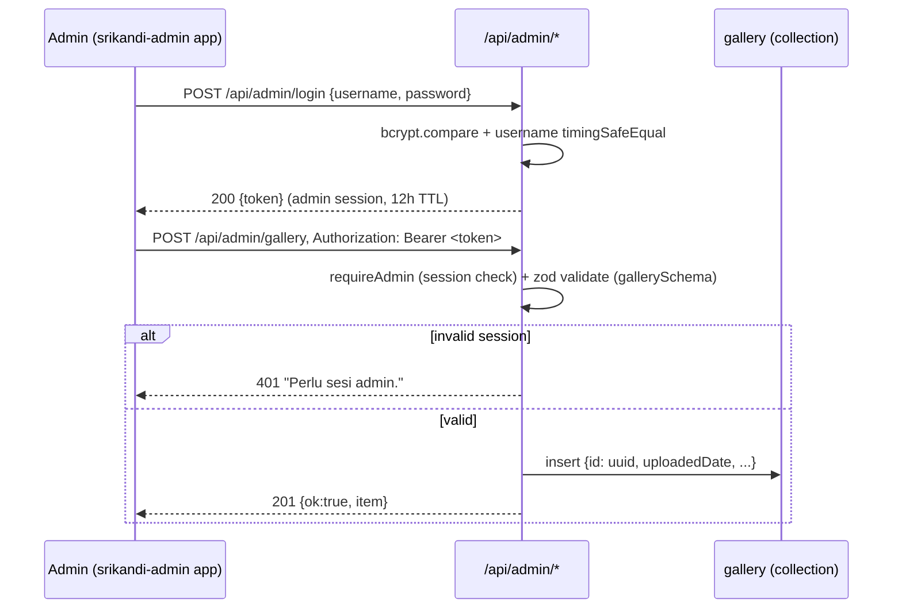
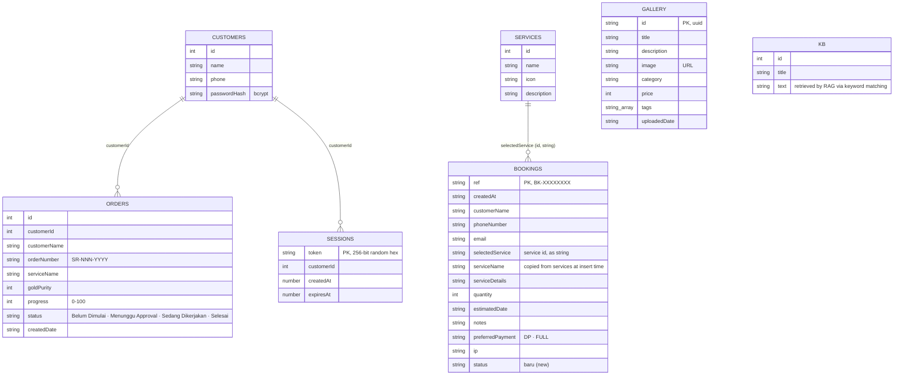
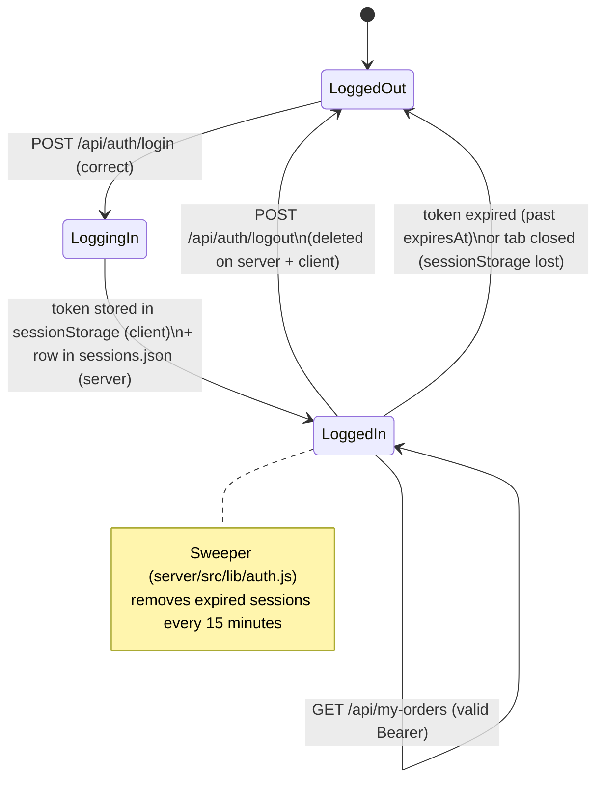

# API Schema & Diagrams — Srikandi

*(English version of [API-SCHEMA.md](API-SCHEMA.md) — the Indonesian file is the
original; keep both in sync if the API changes.)*

A visual map of how the frontend ([`src/`](../../src/)) connects to the backend
([`server/`](../../server/)): which env var points to which endpoint, the
request/response shape of each endpoint, the step-by-step flow of each
feature, and the shape of the data in the JSON store. For status/security
checklists, see [BACKEND.md](BACKEND.md) and [SECURITY.md](SECURITY.md) —
this document focuses on **shape & flow**, not done/not-done status.

> Diagrams use [Mermaid](https://mermaid.js.org) — rendered automatically on
> GitHub, in VS Code (with the Markdown Preview Mermaid extension), and in
> Claude Code.

---

## 1. Connection map — env var ↔ file ↔ endpoint

This is the most important part for "wiring things up": every frontend
feature is connected to the backend through **one env var**, read by **one
config file**, calling **one route** on the server. Without the env var set,
the frontend automatically falls back to local dummy data (no error).

| UI feature | Env var (`.env.local`, project root) | Read in | Calls endpoint | If the env var is empty |
|---|---|---|---|---|
| "Buat Janji" booking form ([BookingPage.jsx](../../src/components/BookingPage.jsx)) | `VITE_BOOKINGS_API` | [BookingForm.jsx](../../src/components/BookingForm.jsx) | `POST {VITE_BOOKINGS_API}` | Form doesn't submit, just `console.debug`s the payload |
| Login + "Lihat Pesanan" (orders) ([OrdersPage.jsx](../../src/components/OrdersPage.jsx)) | `VITE_ORDERS_API` | [config/orders.js](../../src/config/orders.js) | `POST {VITE_ORDERS_API}/auth/login`<br>`GET {VITE_ORDERS_API}/my-orders` | Uses 60 deterministic dummy customers (see ORDERS-AUTH.md) |
| "Konsultasi" chat ([ConsultationPage.jsx](../../src/components/ConsultationPage.jsx)) | `VITE_CONSULT_API` | [config/consultation.js](../../src/config/consultation.js) | `POST {VITE_CONSULT_API}` | Uses `mockConsult()` — local keyword matching against `site.js` |
| Gallery ([GalleryPage.jsx](../../src/components/GalleryPage.jsx)) | `VITE_GALLERY_API` | [config/gallery.js](../../src/config/gallery.js) | `GET {VITE_GALLERY_API}` | Uses `siteConfig.galleries` (static data in `site.js`) |

The backend itself (`server/.env`) has its own, separate set of env vars —
see §7.



---

## 2. Overall architecture



---

## 3. Endpoints — request & response shape

Full field definitions live in the `zod` schemas —
[`server/src/lib/validate.js`](../../server/src/lib/validate.js).

| # | Endpoint | Auth | Rate limit | Request | Success response |
|---|---|---|---|---|---|
| 1 | `GET /api/health` | — | global 120/min | — | `{ ok: true, ts }` |
| 2 | `POST /api/bookings` | — | 5/min/IP | `{customerName, phoneNumber, email, selectedService, serviceDetails, quantity, estimatedDate, notes?, preferredPayment: "DP"\|"FULL", website?}` (honeypot) | `201 { ok: true, ref: "BK-XXXXXXXX" }` |
| 3 | `POST /api/auth/login` | — | 10/10min/IP | `{phone, password}` | `200 { token, customer: {id, name, phone} }` |
| 4 | `POST /api/auth/logout` | Bearer | global | — | `200 { ok: true }` |
| 5 | `GET /api/my-orders` | Bearer | global | — | `200 { orders: [{id, orderNumber, serviceName, goldPurity, progress, status, createdDate}] }` — **only the token holder's own orders** |
| 6 | `POST /api/consult` | optional (Bearer) | 8/min/IP + 40/day/sender | `{messages: [{role: "user"\|"assistant", content}], …}` (max 30 messages, 4000 chars/message) | `200 { reply, sources?, functions?, escalate?, mode }` |
| 7 | `GET /api/gallery` | — | global | — | `200 { items: [...] }` |
| 8 | `POST/PUT/DELETE /api/admin/gallery[/:id]` | admin session (`requireAdmin`) | global | `{title, image, description?, category?, price?, tags?}` | `201 { ok: true, item }` |

Common errors: `400` (validation failed), `401` (auth failed/expired), `404`
(route not found), `429` (rate limited), `500` (`{ error: "Terjadi kesalahan
di server." }` — no stack trace leaked, see SECURITY.md §2).

---

## 4. Per-feature flow (sequence diagrams)

### 4.1 Booking form



### 4.2 Login + view orders



### 4.3 Consultation (chatbot, with tool-calling)



> Important UI rule: `reply` **must not** repeat, as text, a list that is
> already present in `functions[].data` — see [CHATBOT.md](CHATBOT.md).

### 4.4 Add a gallery item (admin)



> The legacy `POST /api/gallery` route + static `ADMIN_TOKEN` secret have been
> removed — gallery writes go through an admin session only.

---

## 5. Data schema (`server/data/*.json`)

Storage isn't SQL — each "table" is one JSON file holding an array of
objects (`server/src/db.js`). The relationships below are drawn for clarity,
not enforced as real foreign keys.



`ORDERS.orderNumber` is used by the chatbot (`cekStatusPesanan`) to look up an
order across all customers, but it now **requires ownership verification**: order
number + orderer name + registered phone must all match before any detail is
returned (phone matched exactly via `normalizePhone`, name by token match).
Otherwise the tool returns `needVerification`/`mismatch`. Details in
[SECURITY.md](SECURITY.md) §2.

---

## 6. Session lifecycle (auth)



---

## 7. Environment variables — full map

### Frontend (`.env.local`, project root)

| Var | Example | Used in |
|---|---|---|
| `VITE_ORDERS_API` | `http://localhost:8787/api` | `config/orders.js` |
| `VITE_CONSULT_API` | `http://localhost:8787/api/consult` | `config/consultation.js` |
| `VITE_BOOKINGS_API` | `http://localhost:8787/api/bookings` | `components/BookingForm.jsx` |
| `VITE_GALLERY_API` | `http://localhost:8787/api/gallery` | `config/gallery.js` |

### Backend (`server/.env`, example in `server/.env.example`)

| Var | Example | Used in | Effect |
|---|---|---|---|
| `PORT` | `8787` | `config.js` | Server port |
| `NODE_ENV` | `development` / `production` | `config.js`, `index.js` | `production` → `httpsRedirect` on + boot **aborts** if `ADMIN_PASSWORD_HASH` is still the repo example hash + warns if `DATA_ENCRYPTION_KEY` is empty |
| `CORS_ORIGINS` | `http://localhost:5173,http://localhost:4173` | `middleware/security.js` | Storefront origin allowlist |
| `ADMIN_ORIGINS` | `http://localhost:5174` | `middleware/security.js` | Admin-hub origin allowlist (merged into CORS) |
| `SESSION_TTL` | `86400` (seconds) | `lib/auth.js` | Customer session token lifetime |
| `ANTHROPIC_API_KEY` | `sk-ant-...` (leave empty for fallback) | `lib/claude.js` | Enables Claude; empty → local keyword-based answers |
| `ANTHROPIC_MODEL` | `claude-opus-5` | `lib/claude.js` | Model to call |
| `CONSULT_DAILY_LLM_BUDGET` | `300` | `lib/llmbudget.js` | Daily cap on real Claude calls; over → fallback |
| `DATABASE_URL` | empty / `postgresql://…` | `db.js` | Empty = JSON file; set = Postgres (required on Render) |
| `DATA_ENCRYPTION_KEY` | 32-byte base64 (`npm run gen:datakey`) | `lib/datacrypt.js` | At-rest encryption for sensitive collections; empty = plaintext |
| `DATA_ENCRYPTION_KEY_OLD` | old key | `lib/datacrypt.js` | Rotation only (`npm run rotate:datakey`) |
| `DATA_RETENTION_DAYS` | `90` | `lib/retention.js` | Drop old `ip` fields; `0` = disabled |
| `ADMIN_USERNAME` / `ADMIN_PASSWORD_HASH` | `admin` / `$2a$…` | `lib/adminAuth.js` | Admin-hub credentials (`npm run admin:hash -- "pass"`) |
| `ADMIN_SESSION_TTL` | `43200` (12h) | `lib/adminAuth.js` | Admin session lifetime |
| `WHATSAPP_BASE` | `https://wa.me/6281234567890` | `lib/tools.js` (`eskalasiKeAdmin`) | Target of the admin-escalation deep link |

**Setup from scratch:**

```bash
# 1) Backend
cd server
cp .env.example .env      # fill in ANTHROPIC_API_KEY, WHATSAPP_BASE, etc.
npm install
npm run seed               # populate dummy data + print demo accounts
npm run dev                # -> http://localhost:8787

# 2) Frontend (separate terminal, from the project root)
# create .env.local with the 4 VITE_* vars from the §7 table above (no .example file for it)
npm install
npm run dev                # -> http://localhost:5173
```

Without `.env.local` in the root, the frontend still runs fully on dummy
data (no errors) — handy for demoing the UI without running `server/` at
all.
