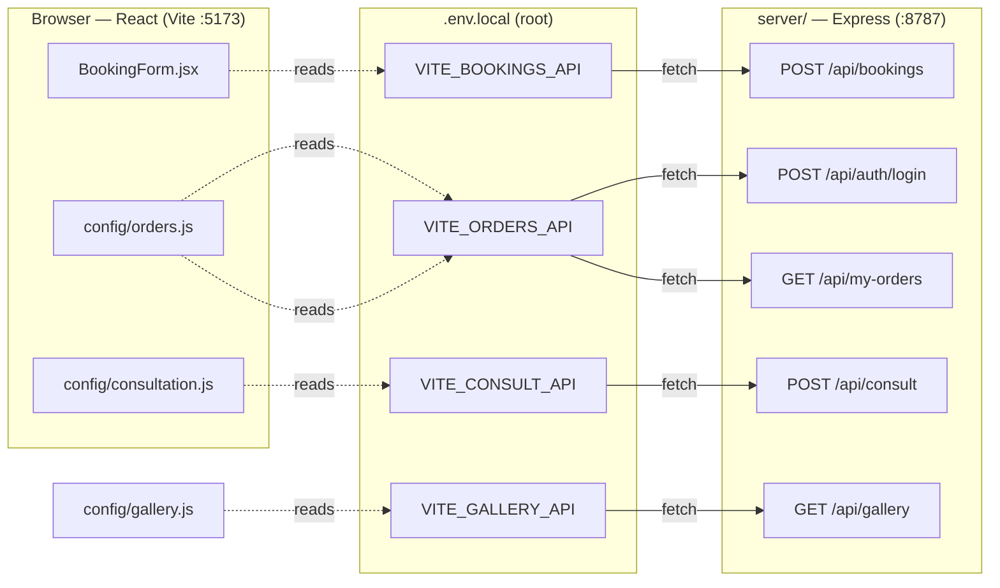
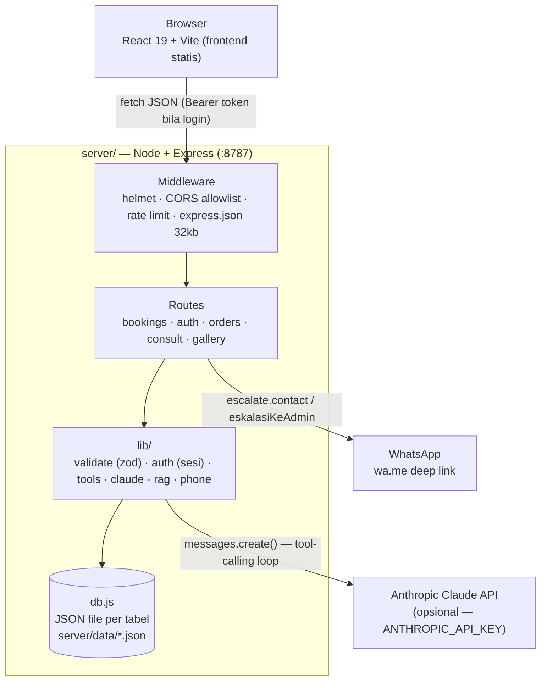
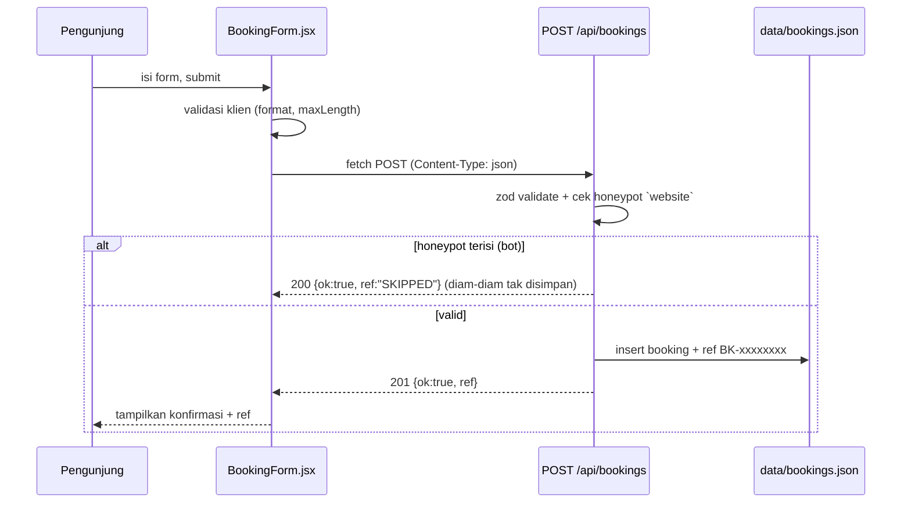
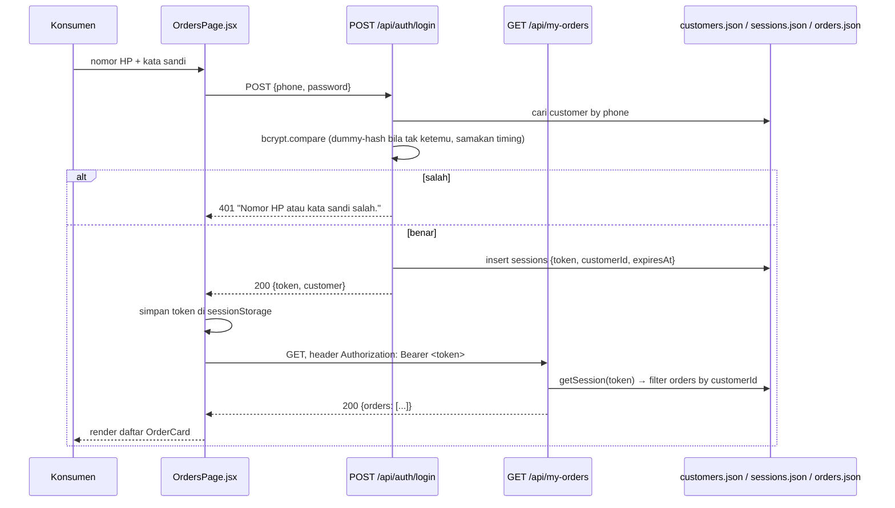
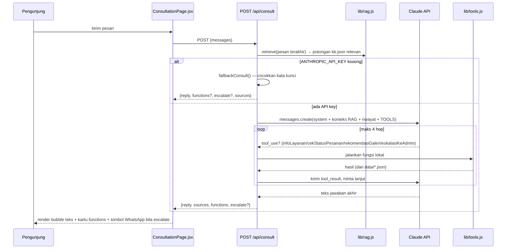
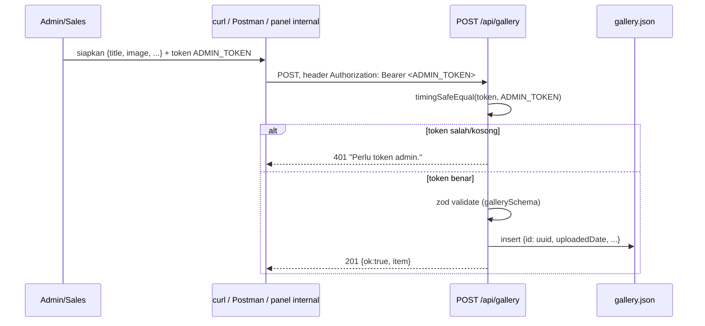
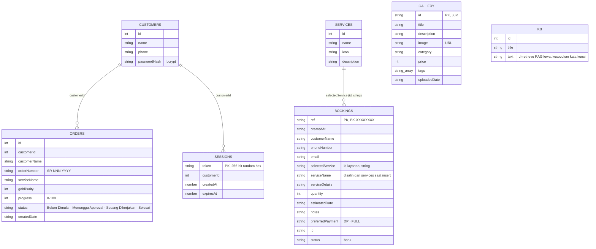
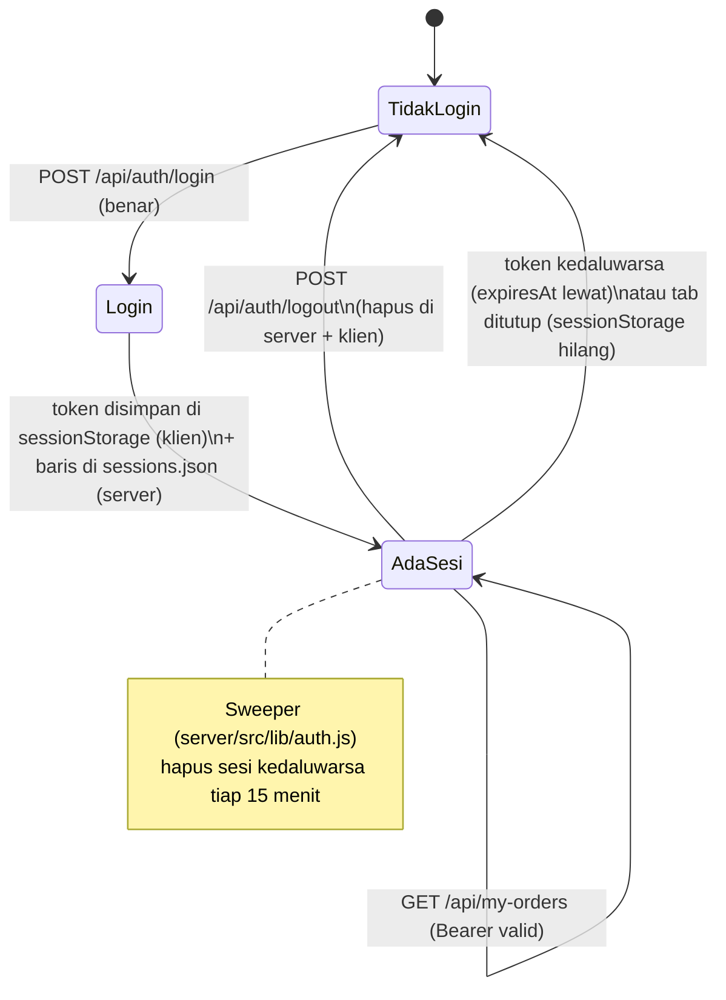

# Skema & Diagram API — Srikandi

Peta visual bagaimana frontend ([`src/`](src/)) terhubung ke backend
([`server/`](server/)): env var apa mengarah ke endpoint apa, bentuk
request/response tiap endpoint, alur tiap fitur langkah-demi-langkah, dan
bentuk data di penyimpanan JSON. Untuk checklist status & keamanan, lihat
[BACKEND.md](BACKEND.md) dan [SECURITY.md](SECURITY.md) — dokumen ini fokus
ke **bentuk & alur**, bukan status selesai/belum.

> Diagram pakai [Mermaid](https://mermaid.js.org) — tampil otomatis di GitHub,
> VS Code (ekstensi Markdown Preview Mermaid), dan Claude Code.

---

## 1. Peta koneksi — env var ↔ file ↔ endpoint

Ini bagian paling penting untuk "menghandel & mengkoneksikan": tiap fitur
frontend dihubungkan ke backend lewat **satu env var**, dibaca oleh **satu
file config**, memanggil **satu route** di server. Tanpa env var-nya diisi,
frontend otomatis jatuh ke data dummy lokal (tidak error).

| Fitur UI | Env var (`.env.local` root) | Dibaca di | Memanggil endpoint | Kalau env var kosong |
|---|---|---|---|---|
| Form "Buat Janji" ([BookingPage.jsx](src/components/BookingPage.jsx)) | `VITE_BOOKINGS_API` | [BookingForm.jsx](src/components/BookingForm.jsx) | `POST {VITE_BOOKINGS_API}` | Form tidak mengirim, cuma `console.debug` payload |
| Login + "Lihat Pesanan" ([OrdersPage.jsx](src/components/OrdersPage.jsx)) | `VITE_ORDERS_API` | [config/orders.js](src/config/orders.js) | `POST {VITE_ORDERS_API}/auth/login`<br>`GET {VITE_ORDERS_API}/my-orders` | Pakai 60 konsumen dummy deterministik (lihat ORDERS-AUTH.md) |
| Chat "Konsultasi" ([ConsultationPage.jsx](src/components/ConsultationPage.jsx)) | `VITE_CONSULT_API` | [config/consultation.js](src/config/consultation.js) | `POST {VITE_CONSULT_API}` | Pakai `mockConsult()` — pencocokan kata kunci lokal ke `site.js` |
| Galeri ([GalleryPage.jsx](src/components/GalleryPage.jsx)) | `VITE_GALLERY_API` | [config/gallery.js](src/config/gallery.js) | `GET {VITE_GALLERY_API}` | Pakai `siteConfig.galleries` (data statis di `site.js`) |

Backend sendiri (`server/.env`) punya env var terpisah — lihat §5.



---

## 2. Arsitektur keseluruhan



---

## 3. Endpoint — bentuk request & response

Field lengkap ada di skema `zod` — [`server/src/lib/validate.js`](server/src/lib/validate.js).

| # | Endpoint | Auth | Rate limit | Request | Response sukses |
|---|---|---|---|---|---|
| 1 | `GET /api/health` | — | global 120/mnt | — | `{ ok: true, ts }` |
| 2 | `POST /api/bookings` | — | 5/mnt/IP | `{customerName, phoneNumber, email, selectedService, serviceDetails, quantity, estimatedDate, notes?, preferredPayment: "DP"\|"FULL", website?}` (honeypot) | `201 { ok: true, ref: "BK-XXXXXXXX" }` |
| 3 | `POST /api/auth/login` | — | 10/10mnt/IP | `{phone, password}` | `200 { token, customer: {id, name, phone} }` |
| 4 | `POST /api/auth/logout` | Bearer | global | — | `200 { ok: true }` |
| 5 | `GET /api/my-orders` | Bearer | global | — | `200 { orders: [{id, orderNumber, serviceName, goldPurity, progress, status, createdDate}] }` — **hanya milik pemegang token** |
| 6 | `POST /api/consult` | — | 20/mnt/IP | `{messages: [{role: "user"\|"assistant", content}], …}` (maks 30 pesan, 4000 char/pesan) | `200 { reply, sources?, functions?, escalate? }` |
| 7 | `GET /api/gallery` | — | global | — | `200 { items: [...] }` |
| 8 | `POST /api/gallery` | Bearer = `ADMIN_TOKEN` | global | `{title, image, description?, category?, price?, tags?}` | `201 { ok: true, item }` |

Error umum: `400` (validasi gagal), `401` (auth gagal/kedaluwarsa), `404`
(route tak ada), `429` (rate limit), `500` (`{ error: "Terjadi kesalahan di
server." }` — tanpa stack trace, lihat SECURITY.md §2).

---

## 4. Alur tiap fitur (sequence diagram)

### 4.1 Form pemesanan



### 4.2 Login + lihat pesanan



### 4.3 Konsultasi (chatbot, dengan tool-calling)



> Catatan penting UI: `reply` **tidak boleh** mengulang daftar yang sudah ada
> di `functions[].data` sebagai teks — lihat [CHATBOT.md](CHATBOT.md).

### 4.4 Tambah item galeri (admin)



---

## 5. Skema data (`server/data/*.json`)

Penyimpanan bukan SQL — tiap "tabel" adalah satu file JSON berisi array objek
(`server/src/db.js`). Relasi digambar di bawah untuk gambaran, bukan foreign
key sungguhan.



`ORDERS.orderNumber` dipakai chatbot (`cekStatusPesanan`) untuk mencari
pesanan **lintas semua konsumen** — belum ada pengecekan `customerId` di jalur
ini, beda dengan `GET /api/my-orders` yang sudah aman. Detail risikonya di
[SECURITY.md](SECURITY.md) §2.

---

## 6. Siklus hidup sesi (auth)



---

## 7. Variabel environment — peta lengkap

### Frontend (`.env.local` di root project)

| Var | Contoh | Dipakai di |
|---|---|---|
| `VITE_ORDERS_API` | `http://localhost:8787/api` | `config/orders.js` |
| `VITE_CONSULT_API` | `http://localhost:8787/api/consult` | `config/consultation.js` |
| `VITE_BOOKINGS_API` | `http://localhost:8787/api/bookings` | `components/BookingForm.jsx` |
| `VITE_GALLERY_API` | `http://localhost:8787/api/gallery` | `config/gallery.js` |

### Backend (`server/.env`, contoh di `server/.env.example`)

| Var | Contoh | Dipakai di | Efek |
|---|---|---|---|
| `PORT` | `8787` | `config.js` | Port server |
| `NODE_ENV` | `development` / `production` | `config.js`, `index.js` | `production` mengaktifkan peringatan `ADMIN_TOKEN` default |
| `CORS_ORIGINS` | `http://localhost:5173,http://localhost:4173` | `middleware/security.js` | Whitelist origin yang boleh fetch API |
| `SESSION_TTL` | `86400` (detik) | `lib/auth.js` | Masa berlaku token sesi |
| `ANTHROPIC_API_KEY` | `sk-ant-...` (kosongkan untuk fallback) | `lib/claude.js` | Aktifkan Claude; kosong → jawaban kata kunci lokal |
| `ANTHROPIC_MODEL` | `claude-opus-5` | `lib/claude.js` | Model yang dipanggil |
| `WHATSAPP_BASE` | `https://wa.me/6281234567890` | `lib/tools.js` (`eskalasiKeAdmin`) | Tujuan deep-link eskalasi admin |
| `ADMIN_TOKEN` | ganti dari contoh! | `routes/gallery.js` | Bearer token untuk `POST /api/gallery` |

**Alur setup dari nol:**

```bash
# 1) Backend
cd server
cp .env.example .env      # isi ADMIN_TOKEN sungguhan, dst.
npm install
npm run seed               # isi data dummy + cetak akun demo
npm run dev                # -> http://localhost:8787

# 2) Frontend (terminal lain, dari root project)
# buat .env.local berisi 4 var VITE_* di tabel §7 di atas (tidak ada file .example-nya)
npm install
npm run dev                # -> http://localhost:5173
```

Tanpa `.env.local` di root, frontend tetap jalan penuh dengan data dummy
(tidak error) — cocok untuk demo UI tanpa menjalankan `server/` sama sekali.
